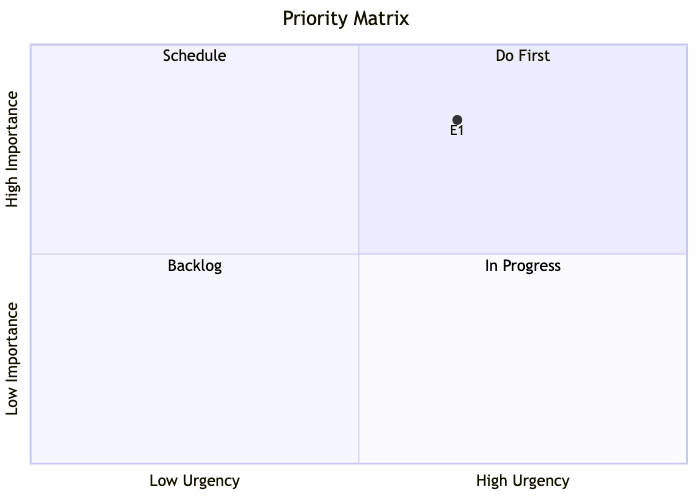

# Roadmap

<!-- Auto-generated by `chart.sh roadmap`. Do not edit manually. -->

| Priority Matrix | Legend |
|:---:|:---|
|  | **Do First**   [E1](docs/epic/Active/(EPIC-001)-Zero-Install-Office-Skills/(EPIC-001)-Zero-Install-Office-Skills.md) Zero-Install Office Skills |

## Recommended Next

> **SPEC-001**: Zero-Install Python Scripts via PEP 723 Inline Metadata — unblocks 2 items, weight: high, score: 6

## Implementation Ready (agent can handle)

| Artifact | Unblocks |
|----------|----------|
| SPEC-001: Zero-Install Python Scripts via PEP 723 Inline Metadata | 2 |
| SPEC-003: Migrate html2pptx to Deno | 1 |
| EPIC-001: Zero-Install Office Skills | — |

### Do First
*High priority, active or unblocking*

| Initiative | Epic | Progress | Unblocks | Needs |
|-----------|------|----------|----------|-------|
| — | [Zero-Install Office Skills](docs/epic/Active/(EPIC-001)-Zero-Install-Office-Skills/(EPIC-001)-Zero-Install-Office-Skills.md) | 0/5 | 0 | — |

### Schedule
*High priority, not yet started*

*(none)*

### In Progress
*Active or unblocking, medium priority*

*(none)*

### Backlog
*Not yet prioritized or started*

*(none)*

## Timeline

